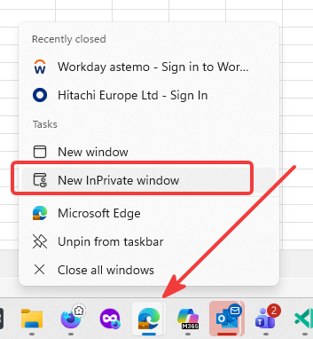
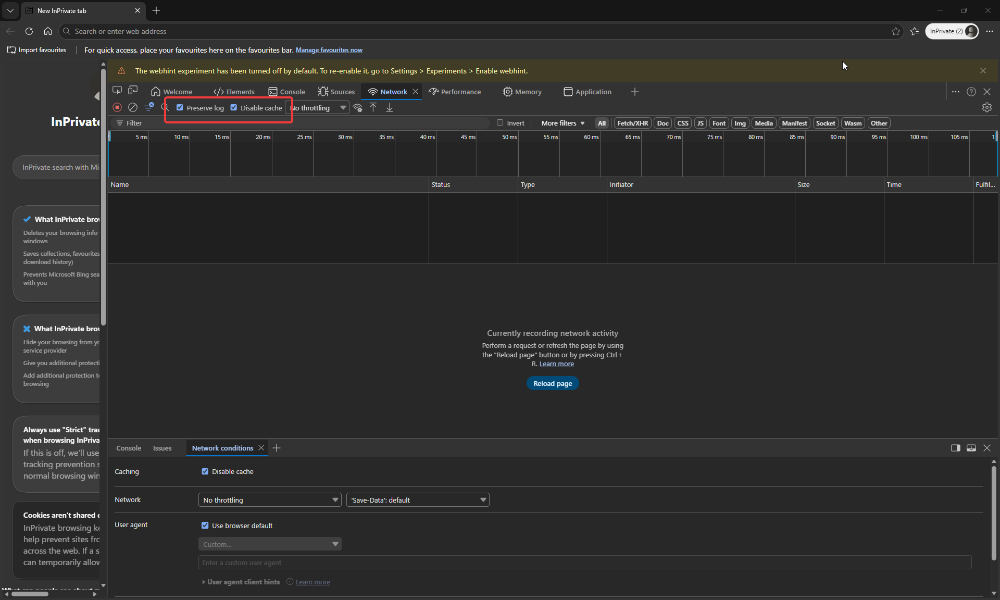
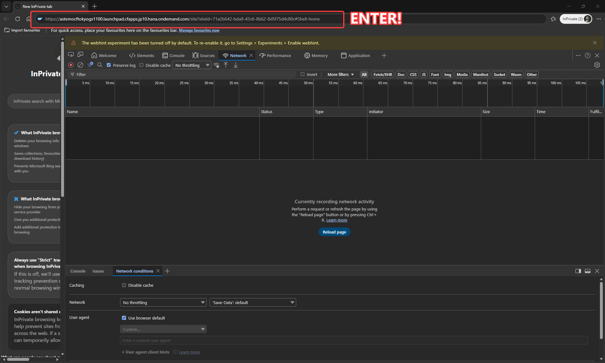
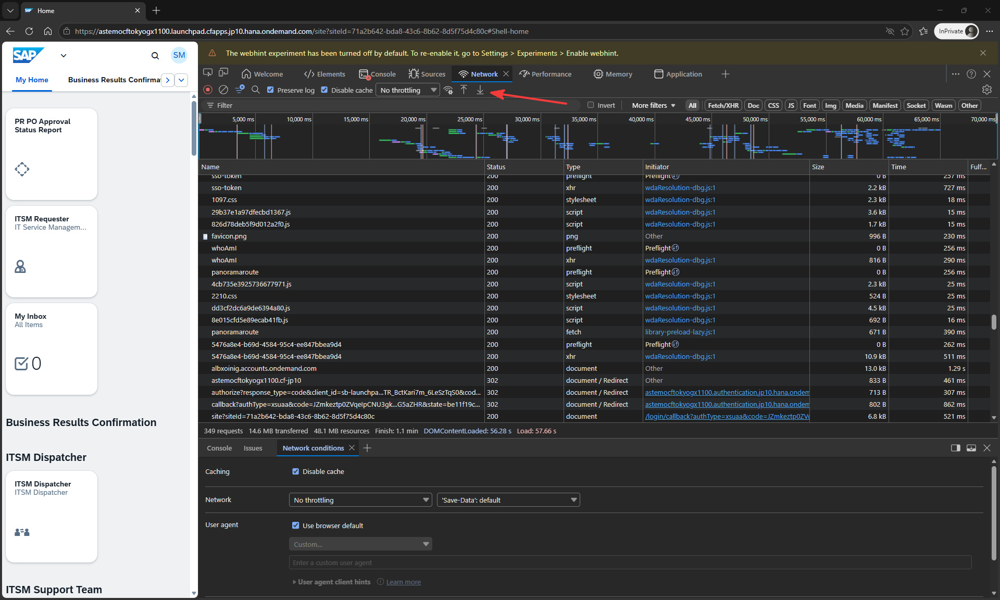

# har-analyzer

Analyze HAR files for performance metrics

## Prequisites

This project requires [Python][phyton] through [uv][uv] and [git][git] of course.

### Install [uv][uv]

```shell
winget install --id=Git.Git -e
winget install --id=astral-sh.uv -e
```

or use any other method to install [uv][uv] and [git][git].


### Activate uv

Open a new terminal!

```shell
git clone https://github.com/smuel-adm/har-analyzer.git
cd har-analyzer

# Creating virtual environment at: .venv
uv venv

# Activate with: .venv\Scripts\activate
.venv\Scripts\activate
```

## Usage

```shell
uv run har_report.py <file.har>
```

## Example Output


## TL;DR

### How to create a .har file

It is important to close all Edge browsers before creating a .har file.

```shell
Open Edge Browser in Incognito Mode
F12
→ Network
→ Preserve Log
→ Disable cache
→ Add URL in Address Bar
→ Hit Enter
→ wait until full load
→ Export HAR
```

**Open Edge Browser in Incognito Mode**



**Hit F12 to open Developer Tools, select Network tab, check preserve log and disable cache checkboxes**



**insert URL in Address Bar and hit Enter**



**wait until full load and export HAR**




[git]: https://git-scm.com/
[uv]: https://astral.sh/uv/
[phyton]: https://www.python.org/
